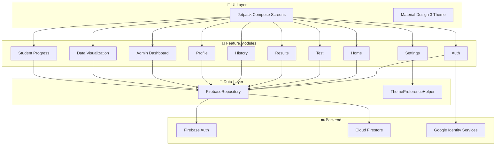

<div align="center">

# 🧠 Emotion

### *Your Mental Wellness Companion*

**A modern Android application for administering the DASS-42 (Depression, Anxiety & Stress Scale), built with Jetpack Compose, Material Design 3, and Firebase.**

[](https://kotlinlang.org)
[](https://developer.android.com/jetpack/compose)
[](https://m3.material.io)
[](https://firebase.google.com)
[](https://developer.android.com)
[](LICENSE)

---


&nbsp;&nbsp;

&nbsp;&nbsp;


</div>

---

## 🌟 What is Emotion?

**Emotion** is a comprehensive mental health screening tool that digitizes the internationally recognized **DASS-42** questionnaire. It helps students and individuals assess their levels of **Depression**, **Anxiety**, and **Stress** through a beautiful, intuitive mobile experience — with an admin dashboard for teachers/counselors to monitor student wellbeing.

> ⚠️ *This app is for informational purposes only and should not replace professional medical advice.*

---

## ✨ Features

### 👤 For Students
| Feature | Description |
|:---|:---|
| 🔐 **Secure Authentication** | Email/Password + Google Sign-In via Firebase |
| 📝 **DASS-42 Assessment** | Interactive 42-question test with progress tracking |
| 📊 **Instant Results** | Animated score cards with severity levels & descriptions |
| 📈 **Assessment History** | Track your mental health journey over time |
| 👤 **Student Profile** | Manage your personal & academic information |
| 🌗 **Dark / Light Theme** | Full theme support across every screen |
| ⚙️ **Settings** | Theme toggle, notifications, and app info |

### 🛡️ For Admins / Teachers
| Feature | Description |
|:---|:---|
| 📋 **Admin Dashboard** | Overview of all student assessments |
| 🚨 **Severe Case Alerts** | Instantly identify students needing attention |
| 📊 **Data Visualization** | Charts and analytics across departments & years |
| 🎯 **Filter & Search** | Filter by department, year, and severity level |
| 👁️ **Student Progress** | View individual student assessment histories |

---

## 🏗️ Architecture

The app follows a clean, modular architecture with clear separation of concerns:



---

## 🛠️ Tech Stack

| Category | Technology |
|:---|:---|
| **Language** | Kotlin 2.0 |
| **UI Framework** | Jetpack Compose + Material Design 3 |
| **Navigation** | Navigation Compose |
| **Async** | Kotlin Coroutines & Flow |
| **Authentication** | Firebase Auth + Google Sign-In (Credential Manager) |
| **Database** | Cloud Firestore |
| **Local Storage** | DataStore Preferences |
| **Build System** | Gradle (Kotlin DSL) |
| **Min SDK** | Android 7.0 (API 24) |
| **Target SDK** | Android 15 (API 36) |

---

## 📂 Project Structure

```
app/src/main/java/com/example/dassscore/
├── 📱 MainActivity.kt              # App entry point
├── 🧭 navigation/
│   └── DassScoreApp.kt             # Navigation host & routing
├── 🎨 ui/theme/
│   ├── Color.kt                    # Color palette (light & dark)
│   ├── Theme.kt                    # Material 3 theme config
│   ├── ThemeUtils.kt               # Dynamic theme-aware helpers
│   ├── ThemePreferenceHelper.kt    # DataStore theme persistence
│   └── Type.kt                     # Typography definitions
├── 📦 data/
│   └── repository/
│       └── FirebaseRepository.kt   # Firebase data operations
├── 📋 model/
│   ├── DassQuestion.kt             # Question data model
│   └── DassResult.kt               # Result data model
└── 🧩 features/
    ├── auth/                        # Login, Register, Forgot Password
    ├── home/                        # Student dashboard
    ├── test/                        # DASS-42 questionnaire
    ├── result/                      # Score display & interpretation
    ├── history/                     # Past assessments
    ├── profile/                     # Student profile management
    ├── settings/                    # App settings
    ├── admin/                       # Admin dashboard
    └── progress/                    # Data visualization & student progress
```

---

## 🚀 Getting Started

### Prerequisites

- **Android Studio** Hedgehog (2023.1.1) or later
- **JDK 11** or higher
- A **Firebase project** with Authentication & Firestore enabled
- **Google Services JSON** file configured

### Setup

1. **Clone the repository**
   ```bash
   git clone https://github.com/Sarang9107/DassScore.git
   cd DassScore
   ```

2. **Firebase Configuration**
   - Create a project at [Firebase Console](https://console.firebase.google.com)
   - Enable **Email/Password** and **Google** sign-in methods
   - Enable **Cloud Firestore**
   - Download `google-services.json` and place it in `app/`

3. **Google Sign-In Setup**
   - Add your app's **SHA-1** fingerprint to Firebase
   - The `default_web_client_id` is auto-generated from `google-services.json`

4. **Build & Run**
   ```bash
   ./gradlew assembleDebug
   ```
   Or simply open in Android Studio and hit ▶️ Run.

---

## 📊 DASS-42 Scoring

The app automatically calculates and interprets scores based on the standard DASS-42 scale:

| Category | Normal | Mild | Moderate | Severe | Extremely Severe |
|:---|:---:|:---:|:---:|:---:|:---:|
| **Depression** | 0–9 | 10–13 | 14–20 | 21–27 | 28+ |
| **Anxiety** | 0–7 | 8–9 | 10–14 | 15–19 | 20+ |
| **Stress** | 0–14 | 15–18 | 19–25 | 26–33 | 34+ |

Each score is displayed with:
- 🟢 **Color-coded severity** indicators
- 📊 **Animated progress bars**
- 📝 **Detailed descriptions** and recommendations

---

## 🌗 Theme Support

Emotion features a fully adaptive **dark/light theme** system:

- 🎨 **Dynamic gradients** that shift between modes
- 🃏 **Glassmorphism cards** that adapt to each theme
- ✍️ **Theme-aware text fields**, icons, and dialogs
- 💾 **Persistent preference** saved via DataStore
- ⚡ **Instant toggle** from Settings or Admin Dashboard

---

## 🤝 Contributing

Contributions are welcome! Feel free to:

1. Fork the project
2. Create a feature branch (`git checkout -b feature/amazing-feature`)
3. Commit your changes (`git commit -m 'Add amazing feature'`)
4. Push to the branch (`git push origin feature/amazing-feature`)
5. Open a Pull Request

---

## 📄 License

This project is licensed under the **MIT License** — see the [LICENSE](LICENSE) file for details.

---

<div align="center">

**Made with ❤️ using Kotlin & Jetpack Compose**

⭐ *If you found this helpful, give it a star!* ⭐

</div>
